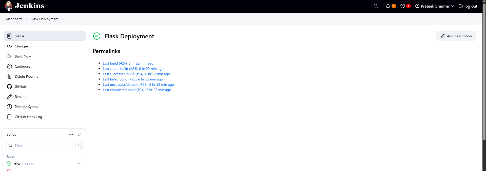
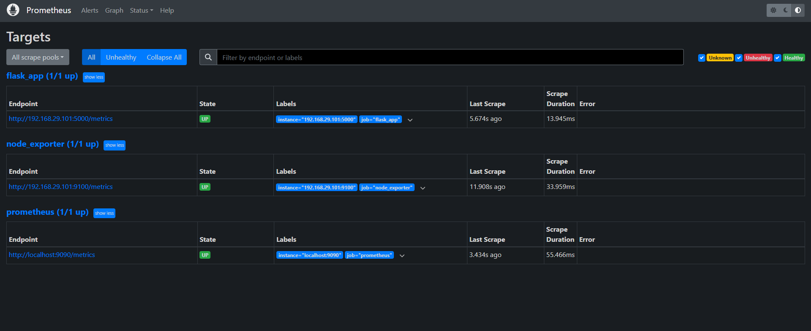

## 🚀 Flask App Deployment with Monitoring & CI/CD

This project is part of a DevOps Internship Challenge by Mediaamp. It demonstrates deploying a Python Flask application simulating a  real-world deployment scenario using Proxmox, Jenkins, Containers & VMs,
 and Monitoring it (Prometheus).

---

## 📦 Folder Structure

```
flask-app-deployment/
│
├── flask_app/         # Flask application with Prometheus metrics
├── jenkins/           # Jenkins pipeline configuration (Jenkinsfile)
├── monitoring/        # Prometheus setup (prometheus.yml, service file)
├── scripts/           # Cron script to monitor Flask app
├── README.md          # Project documentation
```

---

## ⚙️ Setup Instructions

### 🔧 Infrastructure
- **Containerization:** Proxmox LXC Container (Ubuntu).
- **Flask App Host:** 192.168.29.101 (inside container).
- **Prometheus Host:** 192.168.29.100 (VM running Prometheus).

### 🐍 Flask Application
```bash
# Inside container
sudo apt update
sudo apt install python3-pip
pip install flask prometheus_flask_exporter
nohup python3 app.py &
```

### 🔄 Crontab Setup
```bash
crontab -e
# Add this line:
*/5 * * * * /root/flask-app-deployment/scripts/check_flask.sh
```

### ⚙️ Jenkins Pipeline
- Pipeline is defined in `jenkins/Jenkinsfile`.
- Includes build, test, and deploy stages.
- Make sure Jenkins has required plugins installed.

### 📈 Monitoring Setup
- Installed Prometheus on VM.
- Configuration files:
  - `prometheus.yml` in `monitoring/`
  - `prometheus.service` to manage Prometheus via `systemd`

To start Prometheus:
```bash
sudo systemctl daemon-reexec
sudo systemctl start prometheus
sudo systemctl enable prometheus
```

---

## 🧱 Architecture

```text
+--------------------+       +--------------------+
|     Proxmox VM     | <---> |   LXC Container    |
| (Prometheus + Host)|       |  (Flask App + Cron)|
+--------------------+       +--------------------+

- Jenkins is running on VM to manage CI/CD.
- Prometheus scrapes metrics from containerized Flask app.
```

---

## 📊 Metrics Dashboard

- Access Prometheus via: `http://192.168.29.100:9090`
- Target (Flask App): `http://192.168.29.101:5000/compute`
- Custom metric exposed:
  - `compute_requests_total` (Counts `/compute` route hits)

---

## 📸 Screenshots

### 1. Jenkins Pipeline


### 2. Prometheus Metrics Dashboard



---

## ✨ Conclusion

This project demonstrates end-to-end deployment, automation, and monitoring using open-source DevOps tools in a Proxmox-based virtualized environment.

---
